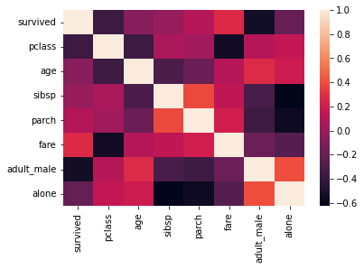

# Headings
"#" is palced before any text to make headings.for example
```markdown
# Heading 1 
## Heading 2
### Heading 3
#### Heading 4
##### Heading 5
###### Heading 6
```
>Output of Above Lines is
# Heading 1 
## Heading 2
### Heading 3
#### Heading 4
##### Heading 5
###### Heading 6

# **FACES**
## Three types of Faces
-   Bold(`**`)
-   Italic(`*`)
-   Bold and Italic(`***`)
# 7- line Break or Pages break
## Triple underscore(`___`), tripple atstric(`***`) or triple dash(`---`) will draw a line

with under score
___
with astaric
***
with dashes 

---

# 8- Hyperlink
[click tp go](www.google.com)
# 9 Adding images and Link on image
## To insert image

# 10. Adding Code or  Block of Code
to print a string use `print("Hello")`
```python
print("hello")
```
>Following is the code to import libraries for data science in Python
```python
import numpy as np
import pandas as pd
import matplotlib.pyplot as plt
import seaborn as sns 
```
# 11 Adding Tables
| Roll No | Name | Class|
| :-------: |----- | ---- |
|1|kashif|11th|
|2|Ahmad|12th
|3|Ahsam|13th
```MarkDown
| Roll No | Name | Class|
| :-------: |----- | ---- |
|1|kashif|11th|
|2|Ahmad|12th
|3|Ahsam|13th
```
# 12 Adding Contents 
[Hadings](#headings)\
[line](#7--line-break-or-pages-break)
# 13 Important Extentsions in Markdown
-   MarkDown All in One
-   Markdown PDF
- [ ] -   Markdownlint
- [ ] 
-   Markdown shortcuts
## below is doing with shortcut keys
**Bold** \
_italic_\
**_bolad and italic_** \
[clicke here to go](www.google)